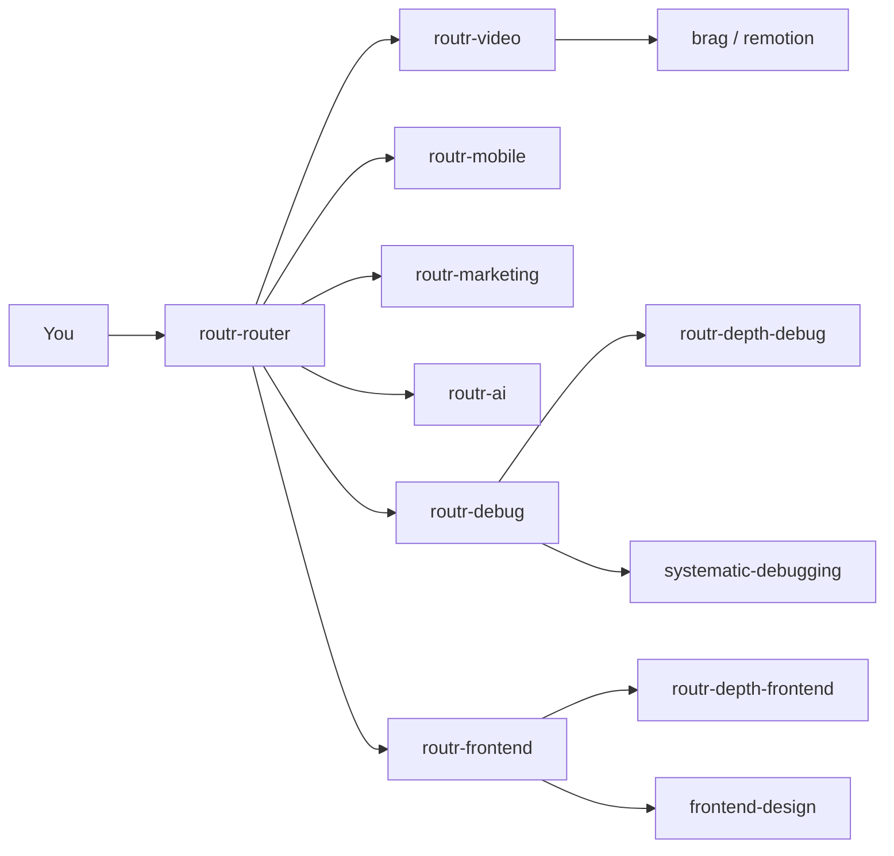

<pre align="center">
██████╗  ██████╗ ██╗   ██╗████████╗██████╗ 
██╔══██╗██╔═══██╗██║   ██║╚══██╔══╝██╔══██╗
██████╔╝██║   ██║██║   ██║   ██║   ██████╔╝
██╔══██╗██║   ██║██║   ██║   ██║   ██╔══██╗
██║  ██║╚██████╔╝╚██████╔╝   ██║   ██║  ██║
╚═╝  ╚═╝ ╚═════╝  ╚═════╝    ╚═╝   ╚═╝  ╚═╝
</pre>

<p align="center">
  <strong>Situational routers for AI coding agents</strong><br />
  <sub>Repo: <a href="https://github.com/TeckTinkerere/ROUTR"><code>ROUTR</code></a> · v2 · by <a href="https://github.com/TeckTinkerere">TeckTinkerere</a></sub></p>

<p align="center">
  
  
  
  
</p>

<p align="center">
  <a href="INSTALL.md"><b>Install</b></a> ·
  <a href="#slash-menu">Slash menu</a> ·
  <a href="#stacks">Stacks</a> ·
  <a href="#all-routers">All routers</a> ·
  <a href="skills/routr-catalog/references/skill-registry.md">Skill registry</a> ·
  <a href="docs/naming.md">Naming</a> ·
  <a href="docs/architecture.md">Architecture</a>
</p>

---

## What is ROUTR?

You installed dozens of skills. The agent picks the wrong one, reads whole files, and burns context.

**ROUTR v2** is standardized **`routr-*` router skills**. Each router:

1. Matches a **situation** (debug, ship, mobile, SEO, AI SDK…)
2. Orders **child skills** to read — canonical names from the registry
3. **Skips** irrelevant skills
4. **Falls back** to `routr-depth-*` when children are missing

> Routers route. Install **child bundles** for Anthropic-grade depth — see [skill registry](skills/routr-catalog/references/skill-registry.md).

```bash
# Interactive — checkbox picker
npx skills add TeckTinkerere/ROUTR -g --copy

# All routr-* routers
npx skills add TeckTinkerere/ROUTR -g --all -y --copy

# Child depth (required for best results)
# See routr-bundle-core / routr-bundle-frontend in skill-registry.md
```

**v2 breaking rename:** `*-playbook` → `routr-*`. Old names redirect. [docs/naming.md](docs/naming.md)

Full install: **[INSTALL.md](INSTALL.md)**

---

## Slash menu

Hover text = YAML `description` in each `SKILL.md`:

| Router | Hover |
|--------|-------|
| `routr-router` | Pick workflow when unclear |
| `routr-debug` | Find and fix bugs step by step |
| `routr-ship` | Fix, verify, commit or PR |
| `routr-frontend` | Build or redesign UI |
| `routr-motion` | Animate existing UI |
| `routr-plan` | Plan, PRD, grill ideas |
| `routr-video` | Video — launch, Remotion, HyperFrames |
| `routr-ai` | AI SDK chat, agents, RAG |
| `routr-mobile` | Expo / React Native |
| `routr-marketing` | SEO, copy, growth |
| … | [Full list in INSTALL.md](INSTALL.md) |

---

## Stacks

### Mobile · Expo / React Native

| Router | Child skills |
|--------|--------------|
| [`routr-mobile`](skills/routr-mobile/) | `building-native-ui`, `vercel-react-native-skills`, `native-data-fetching` |

**Say:** *"Build an Expo tab screen"* → `routr-mobile`

### Marketing & SEO

| Router | Child skills |
|--------|--------------|
| [`routr-marketing`](skills/routr-marketing/) | `seo-audit`, `copywriting`, `ai-seo`, `aso` |

**Say:** *"Audit SEO and rewrite landing copy"* → `routr-marketing` → `routr-frontend`

### AI / LLM apps

| Router | Child skills |
|--------|--------------|
| [`routr-ai`](skills/routr-ai/) | `ai-sdk`, `find-docs` |

Multi-agent architecture → `routr-agents`

### Video · brag, HyperFrames, Remotion

| Router | Child skills |
|--------|--------------|
| [`routr-video`](skills/routr-video/) | `brag`, `remotion-best-practices`, `hyperframes` |

Single entry — `references/launch.md` and `references/remotion.md` for sub-paths.

**Say:** *"/brag about this project"* → `routr-video` → `brag`

---

## All routers

<details>
<summary><b>Core engineering (13)</b></summary>

| Router | Triggers | Top children |
|--------|----------|--------------|
| [`routr-plan`](skills/routr-plan/) | plan, PRD, grill | `brainstorming`, `grill-me`, `to-prd` |
| [`routr-debug`](skills/routr-debug/) | debug, error | `systematic-debugging`, symdex, lean-ctx |
| [`routr-ship`](skills/routr-ship/) | fix, commit, PR | TDD, `caveman-commit` |
| [`routr-test`](skills/routr-test/) | tests, Playwright | `webapp-testing`, `tdd` |
| [`routr-review`](skills/routr-review/) | review PR | `requesting-code-review` |
| [`routr-refactor`](skills/routr-refactor/) | refactor | `improve-codebase-architecture` |
| [`routr-deploy`](skills/routr-deploy/) | deploy, Vercel | `deploy-to-vercel` |
| [`routr-database`](skills/routr-database/) | SQL, Supabase | `supabase-postgres-best-practices` |
| [`routr-qa`](skills/routr-qa/) | browser QA | `agent-browser` |
| [`routr-security`](skills/routr-security/) | security audit | `semgrep` |
| [`routr-explore`](skills/routr-explore/) | how does X work | symdex → lean-ctx |
| [`routr-integrate`](skills/routr-integrate/) | library API | `find-docs` |
| [`routr-agents`](skills/routr-agents/) | agent systems | context-engineering bundle |

</details>

<details>
<summary><b>Product surfaces (6)</b></summary>

| Router | Triggers | Top children |
|--------|----------|--------------|
| [`routr-frontend`](skills/routr-frontend/) | build UI | `frontend-design` |
| [`routr-motion`](skills/routr-motion/) | animate | `framer-motion-animator` |
| [`routr-mobile`](skills/routr-mobile/) | Expo, RN | `building-native-ui` |
| [`routr-marketing`](skills/routr-marketing/) | SEO, copy | `seo-audit`, `copywriting` |
| [`routr-ai`](skills/routr-ai/) | chatbot, AI SDK | `ai-sdk` |
| [`routr-video`](skills/routr-video/) | video, /brag | `brag`, `remotion-best-practices` |

</details>

<details>
<summary><b>Meta + depth fallbacks (8)</b></summary>

| Skill | Role |
|-------|------|
| [`routr-router`](skills/routr-router/) | Pick one router when unclear |
| [`routr-catalog`](skills/routr-catalog/) | Registry, bundles, install commands |
| `routr-depth-debug` | Fallback when `systematic-debugging` missing |
| `routr-depth-frontend` | Fallback when `frontend-design` missing |
| `routr-depth-plan` | Fallback when `brainstorming` missing |
| `routr-depth-ship` | Fallback when `caveman-commit` missing |
| `routr-depth-test` | Fallback when `webapp-testing` missing |

Deprecated `*-playbook` folders redirect to `routr-*`.

</details>

---

## How it works



1. Agent matches router `description` (slash hover).
2. Router lists children to **read** + `references/` for workflow.
3. Missing child? → `routr-depth-*` or [skill-registry.md](skills/routr-catalog/references/skill-registry.md).

---

## Child bundles

| Bundle | Covers |
|--------|--------|
| `routr-bundle-core` | debug, ship, explore, symdex, lean-ctx |
| `routr-bundle-frontend` | frontend-design, Vercel UI, shadcn |
| `routr-bundle-full` | Power-user starter pack |

Install commands in [skill-registry.md](skills/routr-catalog/references/skill-registry.md).

---

## Example flows

**Ship feature + brag video**

```
routr-ship → commit
routr-video → brag
routr-marketing → share copy
```

**AI chat product**

```
routr-plan → brainstorm + PRD
routr-ai → ai-sdk
routr-frontend → chat UI
routr-marketing → ai-seo
```

---

## Evals

Trigger/workflow tests in `evals/` for `routr-router`, `routr-debug`, `routr-frontend`.

---

## Contributing

1. Add `skills/routr-{domain}/SKILL.md` per [authoring.md](docs/authoring.md)
2. Register in `routr-router` + `skill-registry.md`
3. PR

## License

MIT — [TeckTinkerere](https://github.com/TeckTinkerere)

<p align="center"><sub>⭐ Star ROUTR if it saved your context window</sub></p>
