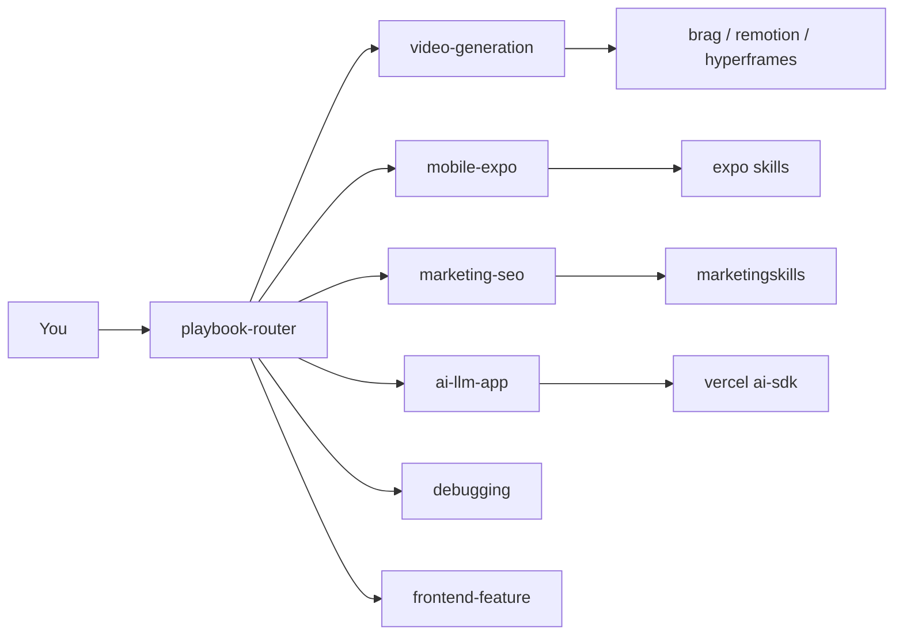

<pre align="center">
██████╗  ██████╗ ██╗   ██╗████████╗██████╗ 
██╔══██╗██╔═══██╗██║   ██║╚══██╔══╝██╔══██╗
██████╔╝██║   ██║██║   ██║   ██║   ██████╔╝
██╔══██╗██║   ██║██║   ██║   ██║   ██╔══██╗
██║  ██║╚██████╔╝╚██████╔╝   ██║   ██║  ██║
╚═╝  ╚═╝ ╚═════╝  ╚═════╝    ╚═╝   ╚═╝  ╚═╝
</pre>

<p align="center">
  <strong>Situational playbooks for AI coding agents</strong><br />
  <sub>Repo: <a href="https://github.com/TeckTinkerere/ROUTR"><code>ROUTR</code></a> · by <a href="https://github.com/TeckTinkerere">TeckTinkerere</a></sub>
</p>

<p align="center">
  
  
  
  
</p>

<p align="center">
  <a href="INSTALL.md"><b>Install</b></a> ·
  <a href="#slash-menu">Slash menu</a> ·
  <a href="#stacks">Stacks</a> ·
  <a href="#all-playbooks">All playbooks</a> ·
  <a href="skills/playbook-common/references/skill-catalog.md">Skill catalog</a> ·
  <a href="skills/playbook-common/references/video-skills-leaderboard.md">Video leaderboard</a> ·
  <a href="docs/architecture.md">Architecture</a>
</p>

---

## What is ROUTR?

You installed dozens of skills. The agent picks the wrong one, reads whole files, and burns context.

**ROUTR** is a set of thin **router playbooks**. Each playbook:

1. Matches a **situation** (debug, ship, mobile, SEO, AI SDK…)
2. Tells the agent **which famous child skills to read** — in order
3. Says what to **skip**

> Routers route. They do not replace child skills.

```bash
npx skills add TeckTinkerere/ROUTR -g --all -y --copy
```

Full install: **[INSTALL.md](INSTALL.md)** (Windows · macOS · Linux · Cursor · Claude · Codex · Kiro · OpenCode)

---

## Slash menu

Hover text in `/` skill picker = YAML `description` in each `SKILL.md`. We keep them short:

> **What it does.** `Use when:` triggers.

| Playbook | Hover |
|----------|-------|
| `playbook-router` | Pick workflow when task is unclear |
| `mobile-expo-playbook` | Build Expo / React Native apps |
| `marketing-seo-playbook` | Marketing copy, SEO, growth |
| `ai-llm-app-playbook` | AI SDK chat, agents, RAG, streaming |
| `video-generation-playbook` | Make a video — route launch vs Remotion |
| `video-launch-playbook` | /brag, launch promo, PR video |
| `video-remotion-playbook` | Remotion React programmatic video |
| `debugging-playbook` | Find and fix bugs step by step |
| `frontend-feature-playbook` | Build or redesign UI |
| … | [Full table in INSTALL.md](INSTALL.md) |

---

## Stacks

Three playbook groups — each routes to top [skills.sh](https://skills.sh) skills in that domain.

### Mobile · Expo / React Native

| Playbook | Child skills (installs) |
|----------|-------------------------|
| [`mobile-expo-playbook`](skills/mobile-expo-playbook/) | `building-native-ui` (57K+), `vercel-react-native-skills` (155K+), `native-data-fetching`, `expo-deployment` |

```bash
npx skills add expo/skills -g --skill building-native-ui --skill native-data-fetching --skill expo-deployment -y --copy
npx skills add vercel-labs/agent-skills@vercel-react-native-skills -g -y --copy
```

**Say:** *"Build an Expo tab screen with native feel"* → `mobile-expo-playbook`

---

### Marketing & SEO

| Playbook | Child skills (installs) |
|----------|-------------------------|
| [`marketing-seo-playbook`](skills/marketing-seo-playbook/) | `seo-audit` (150K+), `copywriting` (140K+), `ai-seo` (82K+), `programmatic-seo`, `aso` |

```bash
npx skills add coreyhaines31/marketingskills -g --all -y --copy
```

**Say:** *"Audit SEO and rewrite landing copy"* → `marketing-seo-playbook` → then `frontend-feature-playbook` to build the page

---

### AI / LLM apps

| Playbook | Child skills (installs) |
|----------|-------------------------|
| [`ai-llm-app-playbook`](skills/ai-llm-app-playbook/) | `ai-sdk` (37K+), `migrate-ai-sdk-v6-to-v7`, `find-docs` |

```bash
npx skills add vercel/ai -g --all -y --copy
```

**Say:** *"Add streaming chat with tool calling"* → `ai-llm-app-playbook` + `frontend-feature-playbook` for UI

For multi-agent architecture (not just AI SDK wiring) → `agent-design-playbook`

---

### Video generation · brag, HyperFrames, Remotion

| Playbook | Child skills (leaderboard) |
|----------|---------------------------|
| [`video-generation-playbook`](skills/video-generation-playbook/) | Routes launch vs Remotion vs HyperFrames |
| [`video-launch-playbook`](skills/video-launch-playbook/) | **`brag`** (#1 launch), `product-launch-video`, `pr-to-video` |
| [`video-remotion-playbook`](skills/video-remotion-playbook/) | `remotion-best-practices` (**401K+**) |

Full ranking: [`video-skills-leaderboard.md`](skills/playbook-common/references/video-skills-leaderboard.md)

```bash
npx skills add latent-spaces/brag@brag remotion-dev/skills@remotion-best-practices -g -y --copy
npx skills add heygen-com/hyperframes -g --all -y --copy
```

**Say:** *"/brag about this project"* → `video-launch-playbook` → `brag`  
**Say:** *"Spotify Wrapped-style video from JSON"* → `video-remotion-playbook` → `remotion-best-practices`

---

## All playbooks

<details>
<summary><b>Core engineering (11)</b></summary>

| Playbook | Triggers | Top skills |
|----------|----------|------------|
| [`planning-playbook`](skills/planning-playbook/) | plan, PRD, grill | `brainstorming`, `grill-me`, `to-prd` |
| [`debugging-playbook`](skills/debugging-playbook/) | debug, error | `systematic-debugging`, SymDex, lean-ctx |
| [`fix-and-ship-playbook`](skills/fix-and-ship-playbook/) | fix, commit, PR | TDD, `caveman-commit` |
| [`testing-playbook`](skills/testing-playbook/) | tests, Playwright | `webapp-testing`, `tdd` |
| [`code-review-playbook`](skills/code-review-playbook/) | review PR | `requesting-code-review` |
| [`refactor-playbook`](skills/refactor-playbook/) | refactor | `improve-codebase-architecture` |
| [`deploy-playbook`](skills/deploy-playbook/) | deploy, Vercel | `deploy-to-vercel` |
| [`database-playbook`](skills/database-playbook/) | SQL, Supabase | `supabase-postgres-best-practices` |
| [`e2e-qa-playbook`](skills/e2e-qa-playbook/) | browser QA | `agent-browser` (499K+) |
| [`security-review-playbook`](skills/security-review-playbook/) | security audit | `semgrep` |
| [`explore-codebase-playbook`](skills/explore-codebase-playbook/) | how does X work | SymDex → lean-ctx |

</details>

<details>
<summary><b>Product surfaces (8)</b></summary>

| Playbook | Triggers | Top skills |
|----------|----------|------------|
| [`frontend-feature-playbook`](skills/frontend-feature-playbook/) | build UI | `frontend-design`, `web-design-guidelines` |
| [`frontend-motion-playbook`](skills/frontend-motion-playbook/) | animate | `framer-motion-animator` |
| [`mobile-expo-playbook`](skills/mobile-expo-playbook/) | Expo, RN | `building-native-ui` |
| [`marketing-seo-playbook`](skills/marketing-seo-playbook/) | SEO, copy | `seo-audit`, `copywriting` |
| [`ai-llm-app-playbook`](skills/ai-llm-app-playbook/) | chatbot, AI SDK | `ai-sdk` |
| [`video-generation-playbook`](skills/video-generation-playbook/) | make a video | `hyperframes`, `brag` |
| [`video-launch-playbook`](skills/video-launch-playbook/) | /brag, launch | **`brag`**, `pr-to-video` |
| [`video-remotion-playbook`](skills/video-remotion-playbook/) | Remotion | `remotion-best-practices` |

</details>

<details>
<summary><b>Meta (3)</b></summary>

| Playbook | Role |
|----------|------|
| [`playbook-router`](skills/playbook-router/) | Pick one playbook when unclear |
| [`library-integration-playbook`](skills/library-integration-playbook/) | Third-party library docs (Context7) |
| [`agent-design-playbook`](skills/agent-design-playbook/) | Context engineering & harnesses |
| [`playbook-common`](skills/playbook-common/) | Install commands for missing skills |

</details>

---

## How it works



1. Agent matches playbook `description` (slash hover).
2. Playbook lists child skills to **read** — not copy.
3. Missing child? → [`skill-catalog.md`](skills/playbook-common/references/skill-catalog.md).

---

## Famous skills we route to

| Skill | Installs | Playbook |
|-------|----------|----------|
| `find-skills` | 2.3M+ | planning |
| `frontend-design` | 610K+ | frontend-feature |
| `vercel-react-best-practices` | 515K+ | frontend, review |
| `agent-browser` | 499K+ | e2e-qa |
| `building-native-ui` | 57K+ | mobile-expo |
| `remotion-best-practices` | 401K+ | video-remotion |
| `brag` | 716★ | video-launch |
| `seo-audit` | 150K+ | marketing-seo |

---

## Example flows

**Expo app + App Store listing**

```
mobile-expo-playbook → building-native-ui
marketing-seo-playbook → aso + copywriting
deploy-playbook → expo-deployment / EAS
```

**Ship a feature + brag video**

```
fix-and-ship-playbook → commit
video-launch-playbook → brag
marketing-seo-playbook → share copy from brag-output
```

**AI chat product**

```
planning-playbook → brainstorm + PRD
ai-llm-app-playbook → ai-sdk + tools
frontend-feature-playbook → chat UI
marketing-seo-playbook → ai-seo for visibility
```

---

## Agents

Cursor · Claude Code · Codex · Kiro · OpenCode · Windsurf · Copilot · Gemini CLI · 70+ via [skills CLI](https://skills.sh)

---

## Contributing

1. Add `skills/your-playbook/SKILL.md` (&lt; 150 lines)
2. Plain `description` for slash hover
3. Update `playbook-router` + `skill-catalog.md`
4. PR

## License

MIT — [TeckTinkerere](https://github.com/TeckTinkerere)

<p align="center"><sub>⭐ Star ROUTR if it saved your context window</sub></p>
